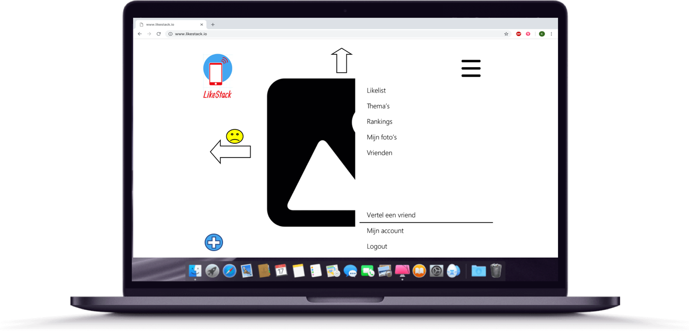

# Technisch ontwerp

### Controller: application.py

/register
GET:     register.html
POST:    invoer om te registreren op onze site. Nagaan of gebruiker al in database staat, en valide gegevens heeft ingevoerd. Indien alles juist is dan wordt de gebruiker toegevoegd aan de database.

/login
GET:    login.html
POST: Pagina om in te loggen op de website. Hierbij moet een gebruikersnaam en wachtwoord ingevoerd worden.  Wanneer gebruiker nog geen account heeft kan deze klikken op de registreer knop en wordt de gebruiker redirect naar /register.

/logout
GET:    logout.html
POST:    Wanneer er op logout wordt geklikt zal de gebruiker uitgelogd worden door middel van session clear().

/friends
Friends.html
Geeft een tabel met alle vrienden die je volgt en hun like score

/
redirect naar feed (login required)

/feed
GET: feed.html een random foto uit de database die de gebruiker nog niet heeft gezien door te checken in history.
POST: foto wordt geplaatst in history met username en gemarkeerd of deze hem heeft geliket, disliket of als ongepast.

/upload
GET: upload.html
POST: foto die de gebruiker heeft geupload wordt in de database van alle foto’s geplaatst.

/likelist
Likelist.html
Selecteerd alle fotos uit History die de user heeft geliket en zet deze op de pagina

/settings
GET: settings.html
POST: update de users database met zijn nieuwe settings
### Views: html-pagina’s
1.      Register.html
2.      Login.html
3.      Feed.html
4.      Upload.html
5.      Likelist.html
6.      Settings.html

### Models/helpers, helpers.py:
Waarschijnlijk maken we nog helpers.py aan voor een dynamische webpagina van feed

### 3 databases:
- Users: Alle gebruikers in deze database inclusief uniek id per gebruiker -> gebruiker-id en settings
- Fotos: Alle fotos in de database inclusief uniek id per foto -> foto-id
- History: Hier wordt de activiteit van de gebruiker bijgehouden. Wanneer een foto door een gebruiker is gezien zal het gebruikers-id samen met het foto-id in deze tabel geplaatst worden. In de derde kolom zal dan een code voor de reactie staan (0 voor dislike, 1 voor like, 9 voor ongepast))

### Plugins en frameworks:
Flask
Flask-uploads
Bootstrap
Jinja
Giphy

### Schetsen foor technisch ontwerp

